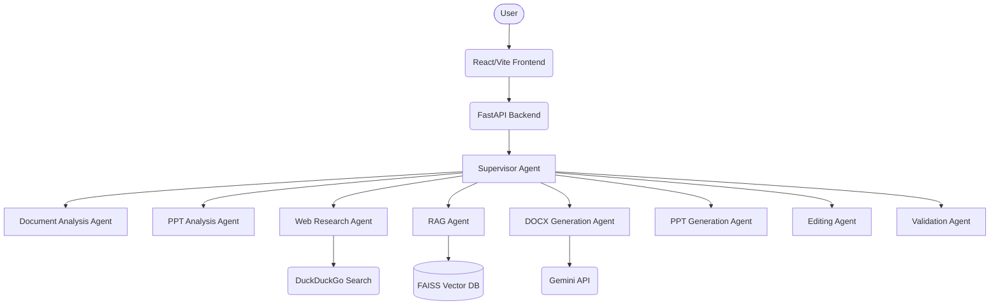

# Enterprise Multi-Agent AI Chatbot for Document & PPT Generation (POC)

This is a Proof of Concept (POC) demonstrating a lightweight, custom multi-agent architecture for document and presentation generation, analysis, and conversational editing.

## Features

- **Multi-Agent Orchestration**: A Supervisor agent delegates tasks to specialized agents (Research, RAG, Generation, etc.).
- **Document & Template Analysis**: Extracts structure from DOCX, PPTX, and PDF.
- **Enterprise RAG**: Local FAISS vector database for indexing knowledge base documents.
- **Web Research**: Integrates DuckDuckGo search for live information gathering.
- **Artifact Generation**: Generates editable DOCX and PPTX files based on context and templates.
- **Conversational Editing**: Chat interface to modify existing artifacts.
- **OCR Support**: Extracts text from images and scanned PDFs.

## Architecture



## Folder Structure

```
Multi-Agent/
├── backend/
│   ├── agents/          # Individual agent implementations
│   ├── database/        # SQLite / FAISS index storage
│   ├── generated/       # Output documents
│   ├── knowledge_base/  # Documents for RAG indexing
│   ├── models/          # Pydantic data models
│   ├── services/        # Integrations (Gemini, OCR, Search)
│   ├── uploads/         # Uploaded templates/documents
│   ├── utils/           # Helper functions
│   ├── .env             # Environment variables
│   ├── main.py          # FastAPI application
│   └── requirements.txt # Python dependencies
└── frontend/
    ├── src/             # React source code
    │   ├── components/  # UI Components
    │   ├── App.jsx      # Main Layout
    │   └── main.jsx     # React Entry
    ├── package.json     # Node dependencies
    └── vite.config.js   # Vite configuration
```

## Prerequisites

- Python 3.12+
- Node.js 18+
- Tesseract OCR (must be installed on the system for OCR features)

## Setup & Installation

### 1. Backend Setup

```bash
cd backend
python -m venv venv
# Windows: venv\Scripts\activate
# Mac/Linux: source venv/bin/activate

pip install -r requirements.txt
```

Add your Gemini API Key in `backend/.env`:
```
GEMINI_API_KEY="your_api_key_here"
```

### 2. Frontend Setup

```bash
cd frontend
npm install
```

## Running the Application

### Start the Backend

```bash
cd backend
# Make sure your virtual environment is activated
uvicorn main:app --reload --host 0.0.0.0 --port 8000
```

### Start the Frontend

```bash
cd frontend
npm run dev
```

The application will be available at `http://localhost:5173` (or the port Vite specifies).

## Workflow Example

1. **Upload**: Open the UI and upload a template PPTX or DOCX file using the right panel.
2. **Chat**: Ask the chatbot: "Research latest Generative AI trends and generate a report."
3. **Orchestration**: The Supervisor Agent interprets the request, triggers the Web Research Agent, formats the context, and responds.
4. **Generate**: In the Artifact panel, select your desired format, optionally choose the uploaded template, and click "Generate".
5. **Download**: Download the resulting editable file.
6. **Edit**: (Mocked for POC) You can ask the bot to edit an existing file, which will duplicate/version it in the backend.

## Future Improvements for Production

- Replace FAISS with a cloud-managed vector DB (e.g., Pinecone, Weaviate).
- Implement persistent memory (PostgreSQL or MongoDB) for `session_id`s instead of in-memory dictionaries.
- Replace synchronous API calls with background tasks / Celery for heavy generation workloads.
- Enhance the Editing Agent with actual AST-level modification logic for DOCX/PPTX instead of duplication.
